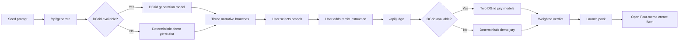

# Remix Royale

Remix Royale is a narrative-first AI product for the Four.Meme AI Sprint. It takes one seed idea, splits it into three competing meme narratives, lets the creator pick a direction, sharpens that direction with a remix instruction, and turns the winner into a Four.meme-ready launch pack.

The product thesis is simple: most tools in this space help people trade memes or launch memes. Remix Royale helps a meme prove it deserves to exist before it gets liquidity.

## What

Remix Royale is an AI arena for meme launch strategy.

Instead of generating one flat concept and calling it done, the app forces competition between narrative branches:

1. Start from one seed prompt.
2. Generate three distinct narrative branches.
3. Pick the branch with the strongest cultural behavior.
4. Add one remix instruction to sharpen tone or participation style.
5. Run a two-model jury.
6. Export a launch pack, a Four.meme field map, and a direct handoff into the create-token flow.

The output is not just creative copy. It is a usable launch brief: name, ticker, hero line, manifesto, visual direction, opening missions, and community prompt.

## Why

### Why this product should exist

Launching a meme is easy. Launching one with repeatable cultural logic is hard.

Most creators can get a funny sentence from AI. What they do not get is a system for answering the harder questions:

- Which version of this meme is the strongest?
- What kind of social behavior does it create?
- Is it screenshot-worthy, ritual-worthy, or instantly legible?
- Can it actually survive handoff from idea to launch page?

Remix Royale exists to structure that decision.

### Why this fits Four.meme

Four.meme is where meme launches happen. Remix Royale sits one step earlier in the funnel and improves launch quality.

It helps creators arrive at Four.meme with:

- a clearer narrative identity
- a stronger first-post angle
- better community missions
- a more defensible reason for the meme to spread

That makes it a strong hackathon fit because it is not competing with Four.meme. It is upstream infrastructure for better launches.

### Why AI matters here

AI is not used here as a generic writing gimmick.

It has two concrete jobs:

1. Generate materially different narrative branches from the same seed.
2. Judge those branches from multiple model perspectives and compress the outcome into a launch decision.

That is more defensible than a single chatbot answer because the product is about structured creative competition, not one-shot generation.

## How

### Product flow

The app opens on a clean pre-generation placeholder. Nothing calls DGrid until the user explicitly clicks `Forge 3 branches`.

The end-to-end flow is:

1. A creator lands on a quiet placeholder state and shapes the seed idea.
2. The creator triggers generation on demand.
3. The app generates three narrative contenders.
4. The creator selects the strongest branch.
5. The creator adds one remix instruction.
6. The AI jury scores the branch on originality, coherence, community fit, and launch readiness.
7. The app returns a launch pack, a launch sequence, a copyable Four.meme field map, and a direct CTA into the Four.meme create form.

### Walkthrough

This is the clean operator path through the product:

1. Land on the placeholder state and explain that nothing runs before user intent.
2. Enter a meme tension or use one of the preset prompts.
3. Click `Forge 3 branches` to create three competing launch directions.
4. Compare the branches for ritual strength, meme clarity, and repeatability.
5. Choose the branch that feels most runnable as a community format.
6. Add one remix instruction to make the direction sharper.
7. Click `Run jury` to turn exploration into a launch decision.
8. Use the launch pack, launch sequence, and Four.meme field map to hand the concept into the Four.meme create form.

### Web3 builder view

From a builder perspective, Remix Royale is not just a copy generator. It is a pre-launch decision layer.

It helps answer the questions that matter before liquidity:

- what is the actual social mechanic
- why would the community repeat it
- what is the first participation loop
- what should the first launch thread or launch page say

That is why the product ends on an operator-style launch pack instead of a generic text dump.

### Four.meme handoff

The handoff now targets the real Four.meme create-token flow.

The result view provides:

- a direct link to `https://four.meme/en/create-token`
- a launch sequence for the operator
- a copyable field map aligned to the actual Four.meme form

The current implementation does not rely on hidden URL-prefill behavior. The create page does not expose a reliable client-side prefill interface, so the handoff is honest and operational instead of pretending to be deeper than it is.

### User-facing output

Each winning launch pack includes:

- token name and ticker
- hero line
- manifesto
- visual direction
- first missions
- launch moments
- community prompt

This is intended to be directly useful in a launch flow, not just interesting to read.

## Architecture



### Tech stack

- Next.js 16 App Router
- React 19
- TypeScript
- Tailwind CSS 4
- DGrid AI Gateway
- Deterministic demo fallback data

### DGrid usage

The app uses DGrid in two distinct product moments.

#### 1. Branch generation

`src/app/api/generate/route.ts` creates exactly three branches from a single seed prompt.

Default model:

- `qwen/qwen3.5-flash`

#### 2. AI jury

`src/app/api/judge/route.ts` runs a two-model panel and returns a single verdict bundle.

Default models:

- `deepseek/deepseek-v3.2`
- `qwen/qwen-plus`

This makes the sponsor integration visible both in code and in the product demo.

### Fallback model

The app is stable even without live API access.

If DGrid is unavailable or a request fails:

- generation falls back to deterministic demo branches
- judging falls back to a deterministic sample jury

That keeps the demo reliable and protects the product story during the hackathon.

## Local setup

### Install

```bash
npm install
```

### Configure environment

```bash
cp .env.example .env.local
```

Environment variables:

```bash
DGRID_API_KEY=
DGRID_BASE_URL=https://api.dgrid.ai/v1
DGRID_GENERATION_MODEL=qwen/qwen3.5-flash
DGRID_JUDGE_MODELS=deepseek/deepseek-v3.2,qwen/qwen-plus
```

### Run locally

```bash
npm run dev
```

Open `http://localhost:3000`.

### Quality checks

```bash
npm run lint
npm run build
```

## Project structure

- `src/app/page.tsx` boots the app with a clean pre-generation placeholder
- `src/app/api/generate/route.ts` creates branch sets from a seed prompt
- `src/app/api/judge/route.ts` runs the multi-model jury
- `src/components/remix-royale-app.tsx` contains the main product flow
- `src/components/battle-board.tsx` renders the branch comparison arena
- `src/components/launch-pack.tsx` renders the verdict, launch sequence, Four.meme field map, and handoff
- `src/lib/demo-data.ts` provides deterministic demo behavior
- `src/lib/dgrid.ts` wraps the DGrid OpenAI-compatible API
- `src/lib/four-meme-handoff.ts` maps launch output into Four.meme create-form fields
- `src/lib/scoring.ts` aggregates scores into a final verdict
- `src/lib/types.ts` defines shared product types

## Vision

Remix Royale should not stop at single-session prompt-to-pack generation.

The long-term vision is to become a cultural operating layer for meme launches, where creators can test, compare, refine, and validate narratives before they hit distribution.

In that version, the product does three things:

1. Helps creators discover the strongest version of their meme.
2. Helps communities participate in shaping launch culture.
3. Helps launch surfaces like Four.meme receive stronger, more legible projects.

## Roadmap

### Near term

- Save battle history and past verdicts
- Share a public launch pack URL
- Add richer Four.meme handoff data once integration surfaces are clearer

### Mid term

- Add collaborative remix rounds so teams can compare alternative directions
- Add lightweight community voting before final jury submission
- Add reusable brand worlds, tone presets, and campaign archetypes

### Long term

- Connect launch packs to post-launch feedback loops
- Learn from downstream performance signals on Four.meme and social channels
- Build a persistent library of meme archetypes and narrative playbooks

## Current limitations

- No persistence yet
- No real-time collaborative remixing yet
- Four.meme handoff is field-mapped and operational, but not auto-prefilled on the external site
- Deterministic fallback content still exists for recovery and demo stability

## Verification

Current validation steps:

- `npm run lint`
- `npm run build`

Both should pass before recording the demo or submitting the repo.
